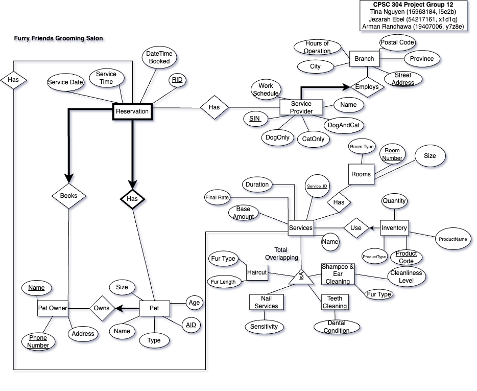

## CPSC 304 Project - Furry Friends Grooming Salon

An appointment management system for animal grooming services. A potential user is either an animal owner looking to book a grooming service, a salon employee managing appointments, as well as inventory and employee management for administrative purposes. 

### Tech Stack

We will use the department provided oracle server as our database. And we will use  JavaScript + Node.js with the Express framework as our Tech stack.

### ER Diagram 

## No Extra Information
